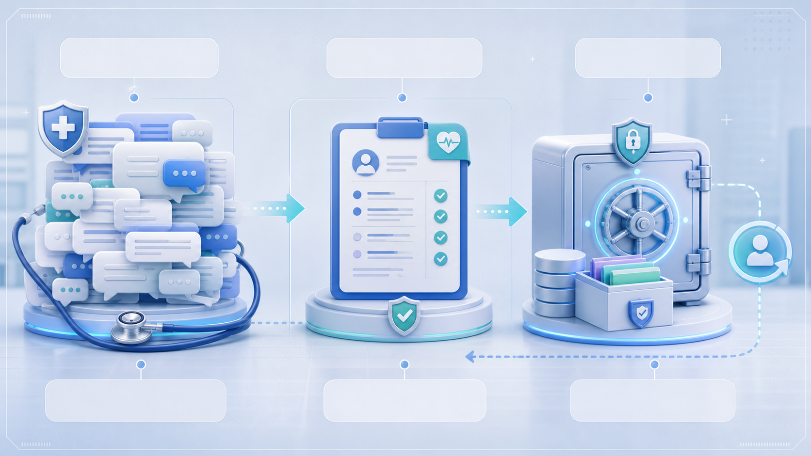
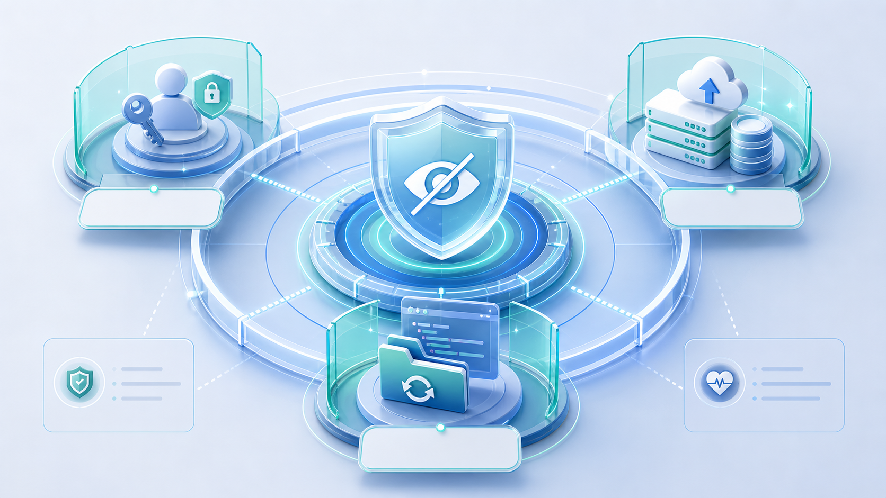

# Codex Speed Doctor

> A local check-up for slow Codex. Find the cause before you clean anything.

[](pyproject.toml)
[](LICENSE)
[](docs/SAFETY.md)
[](docs/TROUBLESHOOTING.md)

**Languages**: [中文](#中文) · [English](#english) · [日本語](#日本語) · [한국어](#한국어)

The GitHub Pages page supports instant in-page switching between Chinese, English, Japanese, and Korean: [docs/index.html](docs/index.html).

## 中文

**中文**：Codex Speed Doctor 是一个本地优先、默认只读的诊断工具，用来判断 Codex Desktop 或 CLI 为什么变慢：是 active session 太大、日志膨胀、插件/Skill warning、model cache 异常，还是本地进程状态不对。

如果你不是工程师，也可以把它理解成 **Codex 的体检报告**：

- 不上来就“清理垃圾”，先看哪里真的异常。
- 不读取你的密钥、账号、Cookie 或私人项目内容。
- 不默认删除文件、不移动会话、不修改配置。
- 把技术问题翻译成下一步可执行建议，例如“先写交接说明，再归档超大的旧对话”。

## English

**English**: Codex Speed Doctor is a local-first, read-only diagnostic tool for slow Codex Desktop or CLI startup. It checks oversized active sessions, large logs, plugin or skill warnings, model cache state, and local process pressure before you touch anything.

## 日本語

**日本語**: Codex Speed Doctor は、Codex Desktop または CLI の起動が遅い原因を調べるローカル優先・既定読み取り専用の診断ツールです。大きな active session、肥大化したログ、plugin/Skill warning、model cache の状態、ローカルプロセスの負荷を整理して確認します。

## 한국어

**한국어**: Codex Speed Doctor는 Codex Desktop 또는 CLI 시작이 느린 원인을 확인하는 로컬 우선, 기본 읽기 전용 진단 도구입니다. 큰 active session, 커진 로그, plugin/Skill warning, model cache 상태, 로컬 프로세스 압력을 점검합니다.


## Who This Is For

Codex Speed Doctor is useful when:

- You use Codex for clinical research, medical writing, literature review,
  data analysis, teaching materials, or long-running AI projects.
- Codex starts slowly, gets stuck while loading models, or feels heavier after
  many long conversations.
- You want to clean local Codex state safely but do not want to accidentally
  delete useful chat history.
- You need a simple handoff-first workflow so important work can be resumed
  from a short note even after old giant sessions are archived.

For medical and non-technical users: this tool does **not** diagnose patients or
medical data. It diagnoses the local Codex app state on your computer, much like
checking whether a workstation is slow because the logbook is huge, too many old
cases are open, or a plugin keeps warning in the background.

## In Plain Language

| If Codex feels... | This tool checks... | What you learn |
| --- | --- | --- |
| Slow to open | Whether too many large active conversations are still in the startup path | Which old conversations should get handoff notes before archiving |
| Stuck around model loading | Whether logs mention model, auth, timeout, or network events | Whether this looks like a local cache/process issue or something outside sessions |
| Noisy after adding tools | Whether plugins or Skills are producing loader warnings | Which area to inspect before disabling anything |
| Hard to clean safely | Whether logs or sessions crossed conservative review thresholds | What to back up first and what not to touch while Codex is running |

## Why It Matters

Long Codex conversations are valuable, especially in research and clinical
workflow building. But very large active sessions can make the app heavier to
resume. Codex Speed Doctor helps separate **memory worth keeping** from **local
state that should leave the hot path**.

The value is not automatic cleanup. The value is safer decision-making:

1. See the local bottleneck.
2. Preserve important context in a handoff note.
3. Archive only what you explicitly selected.
4. Keep restore artifacts so a mistaken archive can be reversed.

## Quick Start

最快只读运行：

```bash
git clone https://github.com/2023Anita/codex-speed-doctor.git
cd codex-speed-doctor
PYTHONPATH=src python3 -m codex_speed_doctor.cli
```

安装成本地命令：

```bash
python3 -m pip install -e .
codex-speed-doctor
```

机器可读输出：

```bash
PYTHONPATH=src python3 -m codex_speed_doctor.cli --json
```

The default report is read-only and pseudonymous. It does not move sessions, delete files, rewrite config, or print raw local session paths.

## Practical Thresholds

The project uses conservative maintenance thresholds learned from real Codex
Desktop cleanup runs:

- Active sessions above **50 MB** are treated as priority handoff/archive
  candidates. They are not archived automatically.
- `logs_2.sqlite` above **64 MB** is watch-worthy.
- `logs_2.sqlite` above **100 MB** should trigger a backup-first log rotation
  plan after Codex is closed.
- Active log burn is treated as a combined condition: **TRACE at or above 70%**
  and `logs_2.sqlite*` bytes or `logs` rows still growing during the sample
  window.

These thresholds are prompts for review, not automatic cleanup rules. The safe
sequence is still diagnose, write handoffs, confirm, then archive or rotate.

## Log Burn Detection

Some quick-fix advice for large Codex logs suggests blocking SQLite inserts or
symlinking the log database into a temporary directory. Codex Speed Doctor takes
a safer path: it first separates **historical log volume** from **active disk
burn**.

The default report samples log growth for 5 seconds and reports:

- `trace_percent`: how much of the log table is TRACE.
- `growth_bytes_delta`: whether the `logs_2.sqlite*` file group grew.
- `growth_rows_delta`: whether new log rows were inserted.

That means a TRACE-heavy log file is not automatically treated as a crisis. It
is only flagged as active log burn when TRACE is dominant and the database keeps
growing during the sample.

Skip the wait when you only need a static snapshot:

```bash
codex-speed-doctor --log-growth-seconds 0
```

This is intentionally more conservative than coarse fixes:

| Coarse approach | Risk | Codex Speed Doctor approach |
| --- | --- | --- |
| Block inserts with a SQLite trigger | Hides diagnostics and mutates a live database | Keep diagnostics read-only; recommend backup-first rotation after Codex exits |
| Symlink `logs_2.sqlite` into `/tmp` | Can confuse SQLite/WAL handling and lose useful evidence | Treat `logs_2.sqlite`, WAL, and SHM as one group |
| Delete or move only the main database | Can leave WAL/SHM state inconsistent | Back up and rotate the whole SQLite file group together |

## What It Diagnoses


| Area | What it checks | Why it matters |
| --- | --- | --- |
| Sessions | active thread count, archived thread count, large active session files | Huge active sessions can stay in the hot startup path and make new windows feel slow. |
| Logs | `logs_2.sqlite` size, warning/error targets, model/auth/network related events | Logs reveal repeated loader, plugin, cache, or network failures without reading private chat content. |
| Plugins | plugin cache size and sampled plugin folders | Manifest or loader warnings can add startup work or noisy retries. |
| Skills | `SKILL.md` count and skill folder size | Broken or stale skills can produce loader warnings before the UI is ready. |
| Model cache | presence, size, and age of `models_cache.json` | A stale or suspicious cache can correlate with "loading models" stalls. |
| Processes | Codex process count, Node process count, top Node memory usage | Helps separate local-state pressure from a live process issue. |

## Recommended Workflow



1. **Diagnose**: run `codex-speed-doctor` first and identify the actual bottleneck.
2. **Handoff**: for important long conversations, write a short continuation note before archiving anything.
3. **Archive**: move only the inactive giant sessions out of the active path using a backup-first maintenance workflow.
4. **Index**: keep a small handoff index so old work can be found by topic later.
5. **Restore**: keep the backup and restore script so a mistaken archive can be reversed.

This tool intentionally stops at diagnosis. Cleanup should be a separate, explicit step after you have reviewed the report.

## Deferred Archive

v0.2 adds an explicit, backup-first archive workflow for oversized Codex session
files. The default `codex-speed-doctor` command is still read-only; archive
actions live behind separate commands.

Create a manifest after you have written a handoff note:

```jsonl
{"slug":"long-running-task","handoff":"/Users/me/Documents/Codex/handoffs/2026-05-17-task.md","source":"/Users/me/.codex/sessions/2026/05/15/rollout-example.jsonl"}
```

From inside Codex, start a deferred archive job:

```bash
codex-speed-doctor-defer-archive --manifest "/absolute/path/manifest.jsonl"
```

It returns immediately with:

```text
job_id deferred-archive-...
log_path /Users/me/.codex/archive_jobs/.../archive.log
status_path /Users/me/.codex/archive_jobs/.../status.json
```

The background worker waits until Codex app-server processes exit, then runs the
safe archive command. Check progress with:

```bash
cat "/path/to/status.json"
tail -n 40 "/path/to/archive.log"
```

Status values:

- `queued` / `launching`: the job was prepared.
- `waiting`: the worker is waiting for Codex to exit.
- `archiving`: backup and archive work is running.
- `done`: archive completed and restore artifacts were written.
- `failed` / `skipped`: read the log and status details.

If a job remains in `waiting`, it is usually protecting local state rather than
failing. Check `status.json` and `archive.log` first. Common blockers include a
freshly reopened Codex app, `codex app-server` processes, older npm/CLI
app-server processes, or Codex Desktop `browser_crashpad_handler` helpers that
survived after the visible window closed. Quit Codex fully, inspect blockers
from a normal Terminal, stop stale Codex processes only after review, and reopen
Codex only after the status is `done` or `failed`. Newer deferred jobs remove
their `launchctl` label after completion, and the archive worker is idempotent
when a status file already says `done`.

If Codex is already closed and you are in a normal Terminal, you can run the
worker directly:

```bash
codex-speed-doctor-archive --manifest "/absolute/path/manifest.jsonl" --wait-for-codex-exit
```

The archive worker writes a `state_5.sqlite` backup, `moved-sessions.jsonl`,
`restore-selected-sessions.py`, and `archive-index.md`.

## Log Rotation Note

Large `logs_2.sqlite` files can slow diagnosis and startup recovery. Rotate logs
only after Codex is closed, or through a deferred helper that waits for Codex
processes to exit. Treat these files as one SQLite group:

- `~/.codex/logs_2.sqlite`
- `~/.codex/logs_2.sqlite-wal`
- `~/.codex/logs_2.sqlite-shm`

Back up and move the whole group together. Do not live-rotate logs while Codex
is running, because SQLite WAL/SHM state can become inconsistent.

## Safety Model



Default behavior:

- read-only report mode
- no automatic cleanup
- no session moves
- no worktree archive
- no `config.toml` rewrite
- no `auth.json` read or output
- no raw session filenames unless you explicitly pass `--details`

See [docs/SAFETY.md](docs/SAFETY.md) for the full boundary and [docs/TROUBLESHOOTING.md](docs/TROUBLESHOOTING.md) for symptom-based fixes.

## Example Output

```text
Codex Speed Doctor
==================
mode: read-only
codex_home: ~/.codex

Sessions
- total_threads: 253
- active_threads: 94
- archived_threads: 159
- active_sessions_gb: 1.836
- large_session_threshold_mb: 50
- large_active_sessions:
  - session_001: 638.0 MB
  - session_002: 484.0 MB

Logs
- logs_mb: 88.9
- log_watch_mb: 64
- log_cleanup_mb: 100
- total_rows: 1932
- level_counts: INFO=561, TRACE=1287, WARN=84
- trace_percent: 66.61
- trace_dominant_percent: 70.0
- growth_sample_seconds: 5.0
- growth_bytes_delta: 0
- growth_rows_delta: 0
- warning_targets: codex_core_plugins::manifest=20, codex_core_skills::loader=64
- model_auth_network_events: 12

Plugins and Skills
- plugin_cache_mb: 245.3
- plugin_dirs_sampled: 42
- skills_mb: 18.7
- skill_files: 66

Model Cache
- exists: true
- size_kb: 24.1
- age_hours: 7.4

Recommendations
- 2 active session(s) are above 50 MB. Treat them as priority handoff/archive candidates: create handoffs first, then archive only after confirmation.
- Skill loader warnings detected. Inspect the affected SKILL.md files before disabling anything.
```

## Commands

```bash
# Default read-only report
codex-speed-doctor

# JSON output for automation
codex-speed-doctor --json

# Static snapshot without waiting for the growth sample
codex-speed-doctor --log-growth-seconds 0

# Show local paths and raw session filenames
codex-speed-doctor --details

# Use a custom Codex home
codex-speed-doctor --codex-home "/path/to/.codex"

# Change the large-session threshold
codex-speed-doctor --large-session-mb 100

# Start a safe deferred archive job from inside Codex
codex-speed-doctor-defer-archive --manifest "/absolute/path/manifest.jsonl"

# Run the backup-first archive worker directly
codex-speed-doctor-archive --manifest "/absolute/path/manifest.jsonl" --wait-for-codex-exit
```

## GitHub Pages

The polished project page lives at [docs/index.html](docs/index.html). After publishing the repository, enable GitHub Pages from the `/docs` directory.

## Development

```bash
python3 -m pip install -e .
PYTHONPATH=src python3 -m unittest discover -s tests
PYTHONPATH=src python3 -m codex_speed_doctor.cli
PYTHONPATH=src python3 -m codex_speed_doctor.cli --json
```

## Design Assets

- [docs/assets/hero-codex-diagnostic.png](docs/assets/hero-codex-diagnostic.png)
- [docs/assets/local-state-map.png](docs/assets/local-state-map.png)
- [docs/assets/handoff-archive-flow.png](docs/assets/handoff-archive-flow.png)
- [docs/assets/safety-boundary.png](docs/assets/safety-boundary.png)
- [design/figma-brief.md](design/figma-brief.md)

## License

MIT
